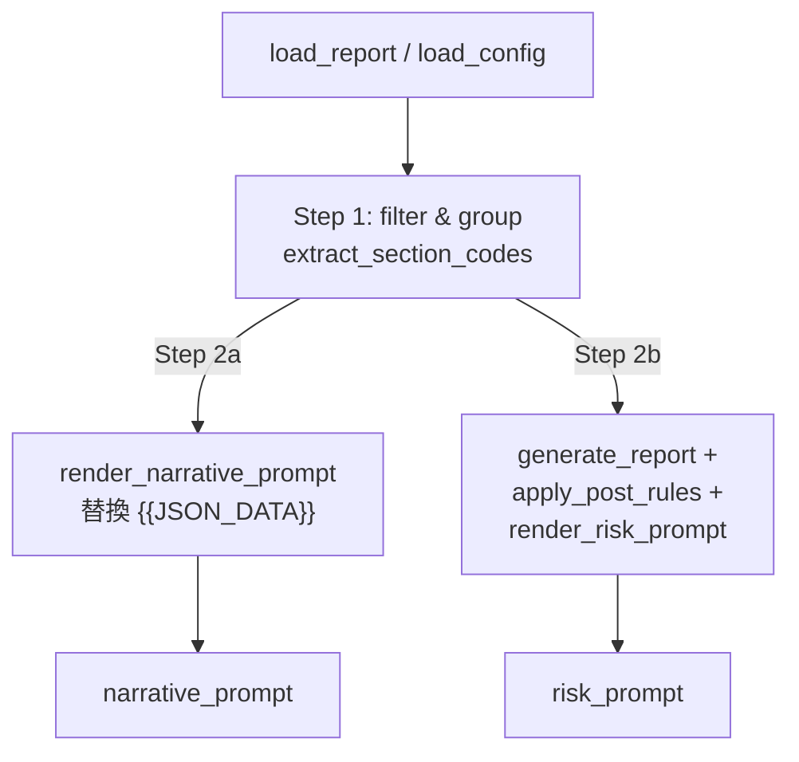
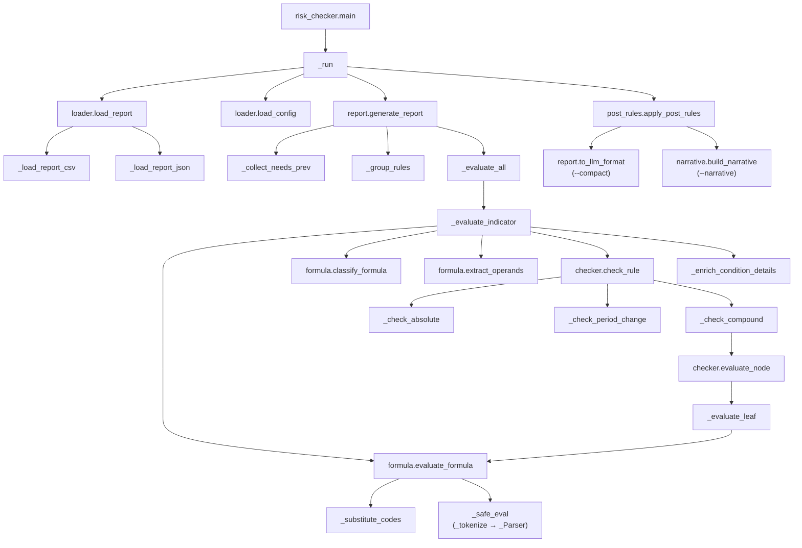
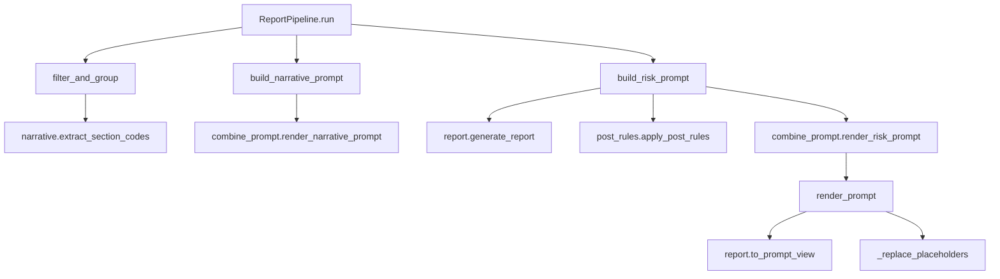
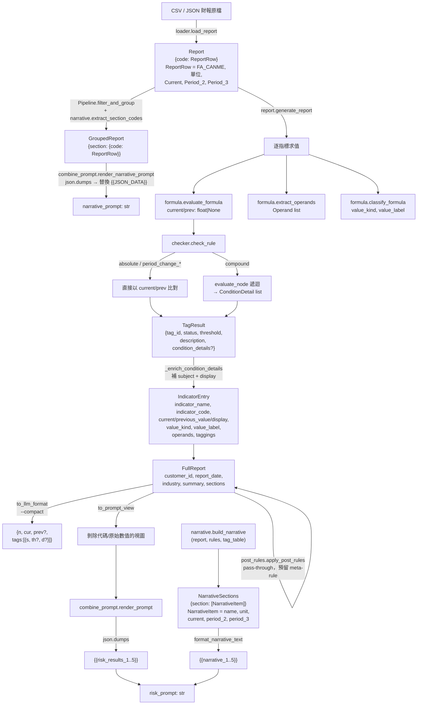
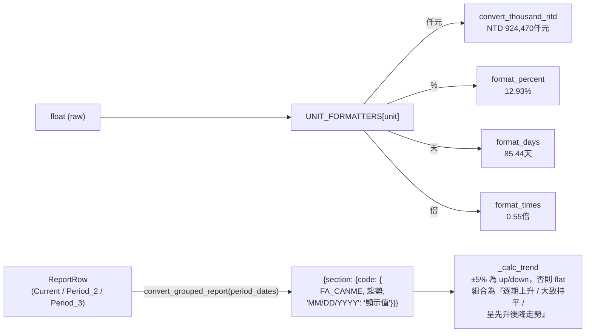

# risk_engine

財報風險判斷引擎。讀取財報資料（CSV / JSON / HTML / Excel）與指標規則設定（JSON），依規則判斷風險觸發狀態，並可進一步組裝給 LLM 使用的敘事與風險 Prompt。

---

## 特色

- **安全公式求值**：以遞迴下降解析器取代 `eval()`，僅允許 `+ - * /` 與括號，杜絕注入風險。
- **中文門檻解析**：自動將「`>150%`」、「`較前期比率增加20%`」、「`A AND B OR C`」等中文門檻轉為結構化規則。
- **策略分派 + 條件樹**：四種比較類型（`absolute` / `period_change_pct` / `period_change_abs` / `compound`）以策略表分派，複合條件以 AND/OR 樹遞迴求值。
- **Pipeline 一條龍**：從原始財報到敘事 Prompt 與風險 Prompt 一次產出。
- **多種資料來源**：支援 CSV、JSON、HTML（Big5）、Excel 格式財報，以及單位（仟元 / % / 天 / 倍）格式化與趨勢推斷。

---

## 專案結構

```
risk_engine/
├── __init__.py              # 公開 API 匯出
├── risk_checker.py          # CLI 主入口
├── pipeline.py              # ReportPipeline：過濾分群 + 敘事 Prompt + 風險 Prompt
├── loader.py                # 財報 / 指標設定載入
├── formula.py               # 安全公式求值、代碼解析、value_kind 推斷
├── threshold.py             # 中文門檻解析（含 compound 樹建構）
├── checker.py               # 門檻比較（策略 + 遞迴樹求值）
├── report.py                # 報告產生、LLM 精簡格式、Prompt 精簡視圖
├── post_rules.py            # 多規則聯合觸發（meta-rule，預留）
├── types.py                 # TypedDict 與自訂例外
├── constants.py             # 共用 regex（OP_PATTERN）
├── log_config.py            # 統一 logging 設定（含 EXE 打包相容）
├── data/
│   ├── indicators_config_v3.json   # 範例指標設定（7大指標）
│   ├── json/                       # 風險結果範例 JSON
│   └── prompt/                     # 敘事 / 風險 sys & user prompt 模板
├── tests/                   # pytest 單元測試（92 tests）
└── utils/
    ├── combine_prompt.py    # 將風險結果 + 敘事填入 Prompt 模板
    ├── narrative.py         # 段落代碼擷取、敘事資料建構
    ├── convert_indicators.py# 指標 CSV → 結構化 JSON 設定
    ├── convert_report.py    # JSON TXT → 段落格式批次轉換
    ├── simple_convert.py    # 單位格式化、趨勢推斷、GroupedReport 轉換
    ├── html_to_json.py      # 財報 HTML（Big5）→ Report JSON
    ├── csv_to_report_json.py# 多家測試案例 CSV → 個別 Report JSON
    ├── xlsx_to_report_json.py# Excel 財報 → Report JSON
    └── convert_to_docx.py   # 分析結果 TXT → Word 文件
```

---

## 系統規格（Spec）

### 輸入

| 項目 | 來源 | 必填欄位 / 約束 |
|------|------|-----------------|
| 財報 | CSV / JSON | CSV 必含 `FA_RFNBR`；JSON 以代碼為 key。每筆需含 `FA_CANME`、`單位`、`Current`，可選 `Period_2`、`Period_3`。空值與非數值字串會轉為 `None`。 |
| 指標設定 | JSON | 以產業為 key；每條規則需含 `section`、`indicator_name`、`indicator_code`、`tag_id`、`value_formula`、`compare_type`、`risk_description`。`compare_type` ∈ `{absolute, period_change_pct, period_change_abs, compound}`。 |
| Prompt 模板 | TXT | 敘事模板需含 `{{JSON_DATA}}`；風險模板需含 `{{risk_results_1}}`–`{{risk_results_5}}`，可選含 `{{narrative_1}}`–`{{narrative_5}}`。 |
| tag_table | CSV（選用） | 提供 `FA_RFNBR` → `FA_CANME` 對應，補齊財報中缺失的中文名稱。 |

### 輸出

| 結構 | 內容 |
|------|------|
| `FullReport` | `customer_id` / `report_date` / `industry` / `summary` / `sections`。`summary` 含 `total_sections`、`total_indicators`、`triggered_count`、`not_triggered_count`、`missing_count`、`total_rules`。 |
| `TagResult.status` | `triggered` / `not_triggered` / `missing`（缺資料、不支援的 `compare_type`、運算溢位皆歸為 `missing`）。 |
| LLM 精簡格式 | 鍵縮寫為 `n` / `cur` / `prev` / `s` / `th` / `d`；狀態縮寫 `T` / `N` / `M`；未觸發 tag 僅留 `{"s": "N"}`。 |
| Prompt 精簡視圖 | 移除 `indicator_code`、原始 `value`、`tag_id`，未觸發 / 缺資料的 tag 不帶 `threshold` / `description`。 |
| Pipeline 結果 | `narrative_prompt` / `risk_prompt` / `grouped_report` / `risk_report`。 |

### 公式 / 門檻 / 條件樹規則

| 規則 | 行為 |
|------|------|
| 公式安全性 | 僅允許 `+ - * /` 與括號；非法字元、未配對括號、除以零都回傳 `None`。 |
| 代碼後綴 | `_PRV` → `Period_2`、`_PRV2` → `Period_3`、無後綴 → `Current`（呼叫端可指定預設期別）。 |
| 缺值傳播 | 任一代碼缺失 → 公式 `None` → 規則 `missing`；條件樹中任一葉缺值 → 整棵樹 `missing`。 |
| AND/OR 分割 | 先以 `\s+OR\s+` 分割（OR 優先），再以 `\s+AND\s+` 分割（AND 次之）；單條件以右起最後一個比較運算子切分公式與門檻。 |
| 全形符號 | `＞` / `＜` / `＝` 自動正規化為半形。 |
| 單位推斷 | 由 config 的 `result_unit` 優先；否則由公式所有代碼的 `單位` 推斷（單位一致且不含除法時採用，仟元 + 除法視為無量綱）。 |

### 例外

- `types.ReportLoadError`：財報載入失敗（檔案不存在、CSV 缺 `FA_RFNBR`、JSON 解析失敗等）。
- `types.ConfigError`：指標設定載入失敗（檔案不存在、JSON 解析失敗、產業不存在）。
- 兩者於 `risk_checker.main` 中以 `sys.exit(1)` 結束；其他未預期錯誤以 `logger.exception` 記錄後同樣 `exit 1`。

### Logging

- Console + 檔案雙輸出，格式 `%(asctime)s [%(levelname)s] %(name)s - %(message)s`。
- 預設 INFO；CLI `--debug` 切為 DEBUG。
- 未指定 `--log` 時寫入 `<base_dir>/log/<YYYYMMDD_HHMMSS>[_<request_id>].log`；EXE 環境（`sys.frozen`）的 base_dir 為執行檔目錄。

---

## 快速開始

### 1. CLI 直接執行

```bash
python risk_checker.py \
    --report 財報.csv \
    --config data/indicators_config_v3.json \
    --industry 7大指標 \
    --customer A00001 \
    --date 20241231 \
    -o result.json \
    [--compact] \
    [--narrative] \
    [--tag-table tag_table.csv] \
    [--log risk_checker.log] \
    [--debug]
```

| 旗標 | 說明 |
|------|------|
| `--report` | 財報檔案路徑（`.csv` / `.json`，依副檔名自動判斷）。 |
| `--config` | 指標設定 JSON 路徑。 |
| `--industry` | 產業名稱（必須存在於設定檔）。 |
| `--customer` | 客戶代碼。 |
| `--date` | 報表日期。 |
| `-o` | 輸出 JSON 路徑（預設 `result.json`）。 |
| `--compact` | 額外輸出 LLM 精簡格式（檔名加 `_compact` 後綴）。 |
| `--narrative` | 同時產出財報敘事段落（需配合 `--tag-table`）。 |
| `--tag-table` | tag_table CSV，補齊財報代碼中文名稱。 |
| `--log` | 自訂 log 檔；未指定時寫入 `log/<timestamp>.log`。 |
| `--debug` | 開啟 DEBUG 級別 log。 |

### 2. Python API

```python
from risk_engine import loader
from risk_engine.pipeline import ReportPipeline

report = loader.load_report("財報.csv")
rules  = loader.load_config("data/indicators_config_v3.json", "7大指標")

with open("data/prompt/財報敘事_user_prompt.txt", encoding="utf-8") as f:
    narrative_template = f.read()
with open("data/prompt/財報風險_user_prompt.txt", encoding="utf-8") as f:
    risk_template = f.read()

pipe = ReportPipeline(
    report=report,
    rules=rules,
    narrative_prompt_template=narrative_template,
    risk_prompt_template=risk_template,
    customer_id="A00001",
    report_date="20241231",
    industry="7大指標",
)
result = pipe.run()
# result["narrative_prompt"]  → 合併後的敘事 Prompt
# result["risk_prompt"]       → 合併後的風險 Prompt
# result["grouped_report"]    → 過濾分群後的報表
# result["risk_report"]       → 風險判定結果
```

也可直接使用低階模組：

```python
from risk_engine import (
    load_report, load_config,
    generate_report, to_llm_format,
    apply_post_rules,
)

report = load_report("財報.csv")
rules  = load_config("indicators_config.json", "7大指標")
risk   = generate_report(report, rules, "A00001", "20241231", "7大指標")
risk   = apply_post_rules(risk)
compact = to_llm_format(risk["sections"])
```

---

## 資料格式

### 財報（Report）

以財報代碼（`FA_RFNBR`）為 key，每筆含中文名稱、單位、與三期數值：

```json
{
  "TIBA040": {
    "FA_CANME": "權益總額",
    "單位": "仟元",
    "Current": 1099433.0,
    "Period_2": 1050000.0,
    "Period_3": 980000.0
  }
}
```

CSV 載入時必須具備 `FA_RFNBR` 欄位；JSON 結構直接以代碼為 key。

### 指標設定（Config）

以產業為 key，每筆規則描述一條判斷邏輯：

```json
{
  "7大指標": [
    {
      "section": "財務結構",
      "indicator_name": "負債權益比",
      "indicator_code": "TIBB002",
      "tag_id": "TIBB002_TAG1",
      "value_formula": "TIBB002",
      "compare_type": "absolute",
      "operator": ">",
      "threshold": 150.0,
      "risk_description": "負債比偏高",
      "result_unit": "%"
    }
  ]
}
```

### 公式語法

| 形式 | 範例 |
|------|------|
| 單一代碼 | `TIBB002` |
| 四則運算 | `TIBB013+TIBB011-TIBB012` |
| 含括號 | `(TIBA049+TIBA047+TIBC003)/TIBA047` |
| 含前期 | `TIBB011-TIBB011_PRV` |
| 含前前期 | `TIBB011-TIBB011_PRV2` |

`_PRV` → `Period_2`，`_PRV2` → `Period_3`，無後綴 → `Current`。

### 門檻語法（中文 → 結構化）

| 類型 | 範例 | `compare_type` |
|------|------|----------------|
| 絕對值 | `>150%` / `<0` / `<=180天` | `absolute` |
| 前期比率變動 | `較前期比率增加20%` | `period_change_pct` |
| 前期絕對變動 | `較前期增加60天` | `period_change_abs` |
| 複合條件 | `(A) AND B OR C` | `compound` |

複合條件依「OR 優先分割、AND 次之」建為樹狀 `condition_tree`，由 `checker.evaluate_node` 遞迴求值；任一葉節點缺資料即整棵樹回傳 `missing`。

### 風險判定結果（FullReport）

```json
{
  "customer_id": "A00001",
  "report_date": "20241231",
  "industry": "7大指標",
  "summary": {
    "total_sections": 5,
    "total_indicators": 18,
    "triggered_count": 5,
    "not_triggered_count": 20,
    "missing_count": 1,
    "total_rules": 26
  },
  "sections": {
    "財務結構": [
      {
        "indicator_name": "...",
        "indicator_code": "...",
        "current_value": 0.55,
        "current_display": "0.55倍",
        "previous_value": null,
        "previous_display": null,
        "value_kind": "current",
        "value_label": "當期值",
        "operands": [...],
        "taggings": [
          { "tag_id": "...", "status": "triggered|not_triggered|missing",
            "threshold": ">1.0", "description": "..." }
        ]
      }
    ]
  }
}
```

### Prompt 精簡視圖（`to_prompt_view`）

組合到風險 Prompt 的版本會做兩件事：**剝除原始代碼/數值**、**未觸發 tag 只留 status**。設計原因是不要把財報代碼（如 `TIBA040`）與原始浮點數送進 LLM，避免模型誤把代碼當成自然語言或在描述中重新換算數值。

對應實作位於 `risk_engine/report.py`，分四層處理：

- `to_prompt_view(sections)` — 入口，逐段落投影。
- `_prompt_indicator(ind)` — 指標層：保留 `indicator_name`、`value_kind`、`value_label`、`current_display`，重建精簡 `operands` 與 `taggings`。
- `_prompt_tag(tag)` — Tag 層：未觸發 / 缺資料只留 `{"status": ...}`；觸發保留 `description` + `threshold` 或 `condition_details`。
- `_prompt_condition_detail(detail)` — Compound 條件明細層：用 `classify_formula` 推導 `kind_label`，引用預先補上的 `subject` / `display`，避免把原始公式送進 LLM。

對照範本：

| 範本 | 來源 | 用途 |
|------|------|------|
| [`data/json/risk_sample.json`](data/json/risk_sample.json) | `report.generate_report` 完整 `FullReport` | debug、CLI `-o` 輸出、`--compact` 進一步精簡 |
| [`data/json/risk_prompt_input_sample.json`](data/json/risk_prompt_input_sample.json) | `report.to_prompt_view` 投影後其中一個段落 | 填入 `{{risk_results_1..5}}` 給 LLM |

**IndicatorEntry 層級**

```
原始 (risk_sample.json)               精簡 (risk_prompt_input_sample.json)
─────────────────────────             ────────────────────────────────────
indicator_name             ✓          indicator_name              ✓
indicator_code             ✗ 剝除
current_value              ✗ 剝除
current_display            ✓          current_display             ✓
previous_value             ✗ 剝除
previous_display           ✗ 剝除
value_kind                 ✓          value_kind                  ✓
value_label                ✓          value_label                 ✓
operands                   ✓          operands                    ✓ (見下)
taggings                   ✓          taggings                    ✓ (見下)
```

**Operand 層級**

```
原始                           精簡
────────────────────           ─────────────────────────────
code                  ✗ 剝除
name                  ✓        name                          ✓
period (Current...)   ✗ 剝除
period_label          ▶ 改名   period (= 原 period_label)    ✓
value (raw float)     ✗ 剝除
unit                  ✗ 剝除
display               ✓        display                       ✓
```

**Tag 層級（依 status 分歧）**

```
not_triggered / missing  →  { "status": "not_triggered" }       ← 其他欄位全部移除
triggered (一般規則)      →  { "status": "triggered",
                                "description": "...",
                                "threshold": ">150.0" }
triggered (compound)     →  { "status": "triggered",
                                "description": "...",
                                "condition_details": [
                                  { "subject", "kind_label",
                                    "display", "operator",
                                    "threshold", "result" }
                                ] }                              ← 不輸出 top-level
                                                                    threshold（含原始代碼）
```

對照原始 `risk_sample.json` 中「固定長期適合率」單一條目：

```json
// 原始
{
  "indicator_name": "固定長期適合率",
  "indicator_code": "(TIBA009-TIBA014)/(TIBA040+TIBA026)",
  "current_value": 0.55,
  "current_display": "0.55倍",
  "previous_value": null,
  "previous_display": null,
  "value_kind": "current",
  "value_label": "當期值",
  "operands": [
    { "code": "TIBA009", "name": "非流動資產",
      "period": "Current", "period_label": "當期",
      "value": 924470.0, "unit": "仟元",
      "display": "NTD 924,470仟元" }
  ],
  "taggings": [
    { "tag_id": "STRUCT_TAG1", "status": "not_triggered",
      "threshold": ">1.0", "description": "不滿足條件" }
  ]
}

// 經 to_prompt_view 投影（即 risk_prompt_input_sample.json）
{
  "indicator_name": "固定長期適合率",
  "value_kind": "current",
  "value_label": "當期值",
  "current_display": "0.55倍",
  "operands": [
    { "period": "當期", "name": "非流動資產",
      "display": "NTD 924,470仟元" }
  ],
  "taggings": [
    { "status": "not_triggered" }
  ]
}
```

`combine_prompt.render_prompt` 會把每個段落投影後的清單以 `json.dumps` 序列化，分別填入 `{{risk_results_1..5}}`：`財務結構` → `{{risk_results_1}}`、`償債能力` → `{{risk_results_2}}`、`經營效能` → `{{risk_results_3}}`、`獲利能力` → `{{risk_results_4}}`、`現金流量` → `{{risk_results_5}}`。

---

## Pipeline 流程



`combine_prompt` 模組會把分群報表填入 `{{JSON_DATA}}` 佔位符（敘事），並把風險結果依段落填入 `{{risk_results_1..5}}`、敘事資料填入 `{{narrative_1..5}}`（合併）。

---

## Function Flow

CLI 與 Pipeline 兩條路徑共用底層模組。

### CLI 入口（`risk_checker.py`）



### Pipeline 入口（`pipeline.ReportPipeline`）



關鍵模組職責：

- `formula.py`：代碼後綴解析（`_resolve_code`）→ 代碼替換為數值（`_substitute_codes`）→ 安全求值（`_tokenize` + `_Parser`）；另提供 `classify_formula`（依結構推斷 `value_kind`）與 `extract_codes` / `extract_operands`。
- `checker.py`：`check_rule` 依 `compare_type` 透過 `_HANDLERS` 分派；`_check_compound` 走 `evaluate_node` 遞迴條件樹。
- `report.py`：把規則依 `(section, indicator_code)` 分組，逐指標收集 operands、套用每條 rule、彙總為 `FullReport`；另提供 `to_llm_format`（縮寫鍵）與 `to_prompt_view`（剝除原始代碼/數值）。
- `combine_prompt.py`：`render_narrative_prompt` 替換 `{{JSON_DATA}}`；`render_risk_prompt` → `render_prompt` 以 `SECTION_MAPPING` / `NARRATIVE_MAPPING` 替換 `{{risk_results_N}}` / `{{narrative_N}}`。

---

## Data Flow

資料在管線中歷經數次型別轉換，每一步都對應一個明確的型別。

### 整體型別轉換鏈



### 格式化輔助（`utils/simple_convert.py`）



關鍵不變式：

- **`None` 即缺資料**：任何階段出現 `None` 一律向上傳播至 `status == "missing"`，不會被預設值替代。
- **不可變代碼集**：`extract_codes` 永遠回傳去重且保留出現順序的基礎代碼（`_PRV` / `_PRV2` 已剝除）。
- **OR 優先解析**：`_build_tree` 與 `_parse_compound` 皆先 `OR` 後 `AND`，與 SQL/Python 慣例反向；撰寫設定時請以括號明確化。
- **Prompt 視圖剝離原始值**：`to_prompt_view` 只保留 `display`，避免把原始代碼或浮點數送進 LLM。

---

## 工具腳本（utils/）

| 腳本 | 用途 |
|------|------|
| `convert_indicators.py` | 將原始指標 CSV 轉為 `indicators_config.json`，自動解析中文門檻並建立 compound 樹。 |
| `html_to_json.py` | 將 Big5 編碼的 4 個財報 HTML 解析為 Report JSON。 |
| `xlsx_to_report_json.py` | 解析單一公司 Excel 財報 → Report JSON（依工作表配置代碼前綴 `TIBA`/`TIBB`/`TIBC`/`TIBD`）。 |
| `csv_to_report_json.py` | 從多家測試案例 CSV 萃取指定公司，輸出個別 Report JSON。 |
| `simple_convert.py` | 預處理財務 JSON：單位格式化（`仟元`/`%`/`天`/`倍`）、計算趨勢、`GroupedReport` 轉為含實際日期 key 的格式。 |
| `combine_prompt.py` | 將風險結果與敘事填入 prompt 模板，提供 `render_prompt`/`render_risk_prompt`/`render_narrative_prompt` 三個介面。 |
| `narrative.py` | 從 rules 提取每段落財報代碼、結合 tag_table 中文名稱、輸出敘事結構（亦可獨立 CLI 執行）。 |
| `convert_report.py` | 批次將 LLM 回傳的 JSON TXT 轉為帶章節標題的段落格式。 |
| `convert_to_docx.py` | 將分析結果 TXT 整理為 Word 文件。 |

---

## 測試

```bash
pytest                                    # 全部 92 個測試
pytest tests/test_formula.py              # 單檔
pytest tests/test_checker.py::TestCheckCompound  # 單類別
pytest --cov=risk_engine --cov=utils      # 覆蓋率
```

詳細測試組成請參考 [`tests/README.md`](tests/README.md)。

---

## 擴展指南

### 新增比較類型

1. 在 `checker.py` 撰寫 `_check_xxx(current_val, prev_val, rule, report)` 函式。
2. 在 `_HANDLERS` 新增一行註冊：

```python
_HANDLERS["my_compare"] = _check_my_compare
```

### 新增中文門檻格式

在 `threshold.py` 的 `parse_threshold()` 加入新的 `re.match` 分支，回傳含 `compare_type` 的 dict。

### 新增 meta-rule（多規則聯合觸發）

`post_rules.py` 已預留接口，並於 docstring 中描述設計骨架：定義 `meta_rule` 設定 → 在 `checker.evaluate_node` 加入 `node_type == "tag_ref"` 分支 → 實作 `apply_post_rules()`。

---

## Logging

`risk_engine.log_config.setup_logging()` 統一設定 root logger，同時輸出至 console 與檔案；未指定路徑時預設寫入程式所在目錄的 `log/<timestamp>_<request_id>.log`，相容 PyInstaller 打包後的 EXE 環境。
