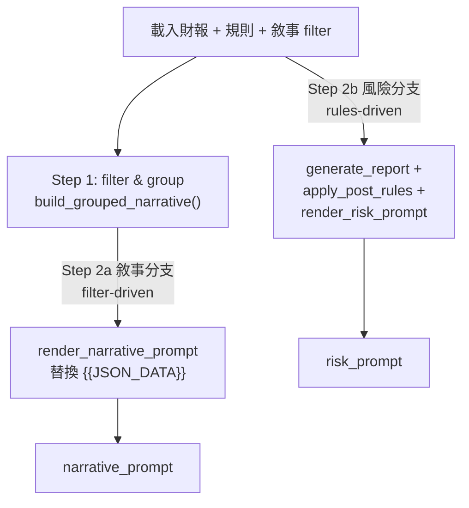

# 03 架構全景

## 核心想法

**唯一對外入口是 [`pipeline.ReportPipeline.run()`](../src/risk_engine/pipeline.py)，一次產出四個結果**：`narrative_prompt` / `risk_prompt` / `grouped_report` / `risk_report`。

內部分為**兩條獨立分支**共用同一份財報：



### 為什麼要分兩條分支？

| 分支 | 驅動來源 | 送進 LLM 的東西 |
|------|---------|----------------|
| 敘事 | `narrative_filter.json` 列出的科目代碼 | **科目原值**（`{section: {code: ReportRow}}` 直接 dump JSON） |
| 風險 | `indicators_config.json` 的規則 | **判定後的精簡視圖**（剝除代碼/原始浮點，只留 `display` 與 status） |

**關鍵設計**：兩者**不共用過濾邏輯**。新增功能時要先決定屬於哪一條分支：

- 想讓 LLM「看到」更多科目原值 → 改 `narrative_filter`
- 想讓 LLM「判定」更多風險 → 改 `indicators_config`

不要把規則資料注入敘事分支，也不要讓敘事 filter 影響風險判定。

---

## 為什麼風險分支要有 `to_prompt_view` 投影層？

[`report.to_prompt_view`](../src/risk_engine/report.py) 在送進 LLM 前刻意做兩件事：

1. **剝除原始代碼/浮點**：移除 `indicator_code`、`operands[].code`、`operands[].value`、`tag_id`。
2. **未觸發 tag 只留 status**：`{"status": "not_triggered"}` 即可，不送 `threshold` 與 `description`。

設計原因：
- 不要把 `TIBA040` 這種代碼送進 LLM — 模型可能把它當自然語言。
- 不要送原始浮點 `924470.0` — 模型可能在敘述中重新換算（如把仟元當元，誤算 1000 倍）。
- 未觸發的 tag 不必告訴 LLM 門檻多少，省 token 也避免噪音。

詳細對照見專案根 [README.md#prompt-精簡視圖to_prompt_view](../README.md#prompt-精簡視圖to_prompt_view) 與 [06_data_flow.md](06_data_flow.md)。

---

## 模組階層

```
scripts/main.py (EXE 入口)
    └── 依序呼叫
        ├── utils.xlsx_to_indicators.convert    （xlsx → rules + filter）
        ├── utils.html_to_json.convert_html_files_to_dict  （4 HTML → Report）
        └── risk_engine.pipeline.ReportPipeline
                ├── filter_and_group()
                │       └── utils.narrative.build_grouped_narrative
                │
                ├── build_narrative_prompt()
                │       └── utils.combine_prompt.render_narrative_prompt
                │
                └── build_risk_prompt()
                        ├── risk_engine.report.generate_report
                        │       ├── risk_engine.formula.evaluate_formula
                        │       │       ├── _resolve_code (期別後綴)
                        │       │       ├── _substitute_codes (代碼→數值)
                        │       │       └── _safe_eval (遞迴下降解析器)
                        │       │
                        │       └── risk_engine.checker.check_rule
                        │               └── _HANDLERS["compound"]
                        │                       └── evaluate_node (遞迴條件樹)
                        │                               └── ... → evaluate_formula
                        │
                        ├── risk_engine.post_rules.apply_post_rules (預留)
                        └── utils.combine_prompt.render_risk_prompt
                                └── risk_engine.report.to_prompt_view
```

```
scripts/risk_checker.py (Legacy CLI)
    └── _run()
        ├── risk_engine.loader.load_report
        ├── risk_engine.loader.load_config
        ├── risk_engine.report.generate_report  （不走 Pipeline）
        ├── risk_engine.post_rules.apply_post_rules
        └── （視 flag 而定）to_llm_format / build_narrative
```

---

## 為什麼有兩個入口？

| 入口 | 用途 | 指標來源 | 財報來源 |
|------|------|---------|---------|
| [scripts/main.py](../scripts/main.py) | **生產 EXE**，後端整合 | xlsx（執行時轉 JSON） | 4 份 Big5 HTML |
| [scripts/risk_checker.py](../scripts/risk_checker.py) | **legacy debug** | JSON | CSV / JSON |

設計動機：
- **xlsx 是唯一指標來源**：產品經理可以直接改 xlsx，不需要重編譯 EXE。為了讓 audit 方便，每次執行會把 xlsx 轉成 JSON 落地到 EXE 同層。
- **HTML Big5**：上游系統是台灣金融業，產出的財報就是 Big5 編碼的 HTML，不能改成讓他們先轉 JSON 再餵進來。
- **legacy CLI 仍保留**：開發者跑回歸時用 JSON 財報比較快（不必重新解析 HTML）；但**不打包進 EXE**。

CLAUDE.md 已寫死：「EXE 不再支援單純讀 JSON 的部署模式」。改動時要把這條規則一起更新。

---

## 共同的核心模組

不論走哪一條入口，`risk_engine` 套件內部的判定邏輯是同一份：

| 模組 | 角色 |
|------|------|
| [`risk_engine.formula`](../src/risk_engine/formula.py) | 代碼後綴解析 + 自寫遞迴下降解析器（**不可用 `eval()`**） |
| [`risk_engine.threshold`](../src/risk_engine/threshold.py) | 中文門檻字串 → 結構化 dict（含 compound 樹） |
| [`risk_engine.checker`](../src/risk_engine/checker.py) | 策略表分派 `_HANDLERS` + 遞迴樹求值 |
| [`risk_engine.report`](../src/risk_engine/report.py) | 規則分組 + 報告組裝 + LLM 格式投影 |
| [`risk_engine.loader`](../src/risk_engine/loader.py) | 財報 / 設定載入（自動偵測 CSV / JSON） |
| [`risk_engine.post_rules`](../src/risk_engine/post_rules.py) | 多規則聯合觸發（**預留**，目前 pass-through） |
| [`risk_engine.types`](../src/risk_engine/types.py) | 所有 TypedDict + 自訂例外 |
| [`risk_engine.pipeline`](../src/risk_engine/pipeline.py) | 雙分支編排（也是唯一對外的 Pipeline 類別） |

模組速查見 [07_module_reference.md](07_module_reference.md)。

---

## 三個一定要記住的不變式

新人最容易踩雷的三件事，先記下來：

1. **None 即缺資料**：任一代碼缺失 → 公式 `None` → 規則 `missing`。**不要**在核心模組裡用預設值替代 `None`。
2. **OR 優先解析**：`A AND B OR C` 解析為 `or(and(A,B), C)`，與 SQL/Python 慣例**反向**。撰寫設定時請以括號明確化。
3. **段落限定五項**：`財務結構` / `償債能力` / `經營效能` / `獲利能力` / `現金流量`。

詳細列表見 [04_spec.md#不變式](04_spec.md#5-不變式必讀)。

---

## 下一步

- 想看正式 spec → [04_spec.md](04_spec.md)
- 想看呼叫鏈細節 → [05_function_flow.md](05_function_flow.md)
- 想看資料流型別轉換 → [06_data_flow.md](06_data_flow.md)
