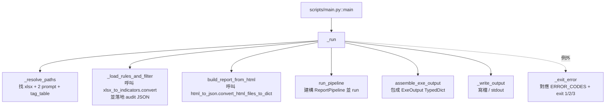
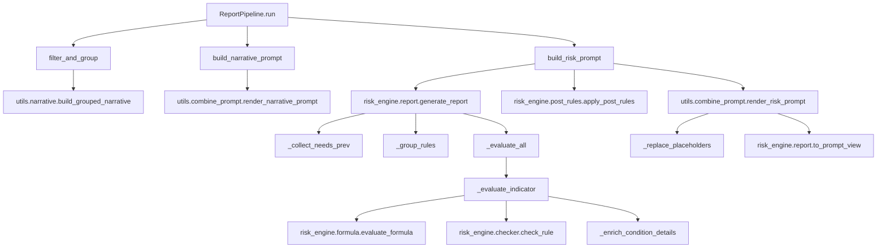
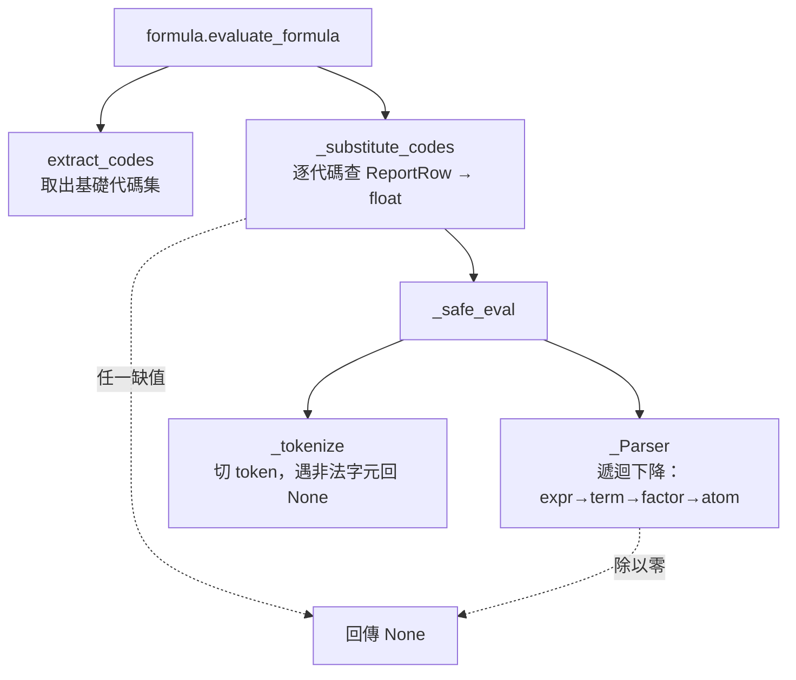
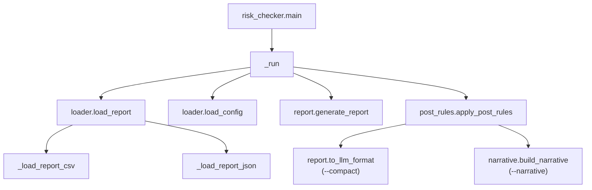

# 05 Function Flow

三條呼叫路徑都最終匯流到 `risk_engine` 套件。下面逐條走一遍，說明**為什麼這樣分層**。本檔聚焦各層級的設計意圖；如果想看精簡版的 mermaid 圖，可比照參考 [README.md#function-flow](../README.md#function-flow)。

> 想看本檔的 mermaid 圖在 GitHub / VS Code 預覽中的渲染，請開 markdown preview。如果只看純文字，每張圖下方都有節點對應的檔案 + 函式名。

---

## 路徑 1：EXE 流程

入口：[`scripts/main.py::main`](../scripts/main.py)（PyInstaller 打包後成 `risk_analysis` EXE）



**為什麼這樣分層？**

- `_resolve_paths`：xlsx 與 prompt 模板必須與 EXE 同層；這層集中處理路徑探測，避免散落各處。三類輸入檔（`indicators_config.xlsx`、`risk_user_prompt.txt`、`narrative_user_prompt.txt`）皆支援版本化檔名 `{base}_V{ver}.{ext}`（如 `risk_user_prompt_V1_1_1.txt`），版本號為 `V` 開頭、`_` 分隔的數字段；多版並存時自動挑最高版（log 印出實際選用檔名），找不到版本化檔則 fallback 到不帶版本的舊檔名。`xlsx` 探測順序：`--xlsx` 旗標 → 版本化 `indicators_config_V*.xlsx`（最高版）→ `indicators_config.xlsx` → EXE 同層唯一一份 `*.xlsx`。
- `_load_rules_and_filter`：xlsx 解析結果**會落地到 EXE 同層的 `indicators_config.json` + `narrative_filter.json`** 作 audit。產品經理改完 xlsx 跑一次，就能拿到落地 JSON 比對。
- `build_report_from_html`：HTML 是 Big5 編碼，必須在這層處理編碼，後面 Pipeline 拿到的就是乾淨 `Report` dict。
- `run_pipeline` 與 `assemble_exe_output` 拆開：前者吐 `PipelineResult`（純資料），後者加上 `schema_version` / `request_id` / metadata，把對外契約集中在一處。

對應檔案：[scripts/main.py](../scripts/main.py)。

---

## 路徑 2：Pipeline 流程（核心）

入口：[`risk_engine.pipeline.ReportPipeline.run`](../src/risk_engine/pipeline.py)



**為什麼這樣分層？**

- **三步驟（Step 1 / 2a / 2b）對應 `pipeline.ReportPipeline` 的三個方法**：
  - Step 1 [`filter_and_group`](../src/risk_engine/pipeline.py)：純 filter-driven，依 `narrative_filter` 撈科目。**不會碰指標規則**。
  - Step 2a [`build_narrative_prompt`](../src/risk_engine/pipeline.py)：把 Step 1 的分群 JSON 填進敘事模板。
  - Step 2b [`build_risk_prompt`](../src/risk_engine/pipeline.py)：用**完整原始報表**（不是 Step 1 的子集）做風險判定。
- Step 2a 與 2b **邏輯上互相獨立**，唯一交集是 Step 0 載入的同一份財報；Pipeline 只是序列執行，並非依賴關係。
- `report.generate_report` 內部的三段（`_collect_needs_prev` → `_group_rules` → `_evaluate_all`）拆開的原因是 `_collect_needs_prev` 必須先掃過所有規則才能決定哪些指標需要算 Period_2，否則會多算。
- `to_prompt_view` 從風險判定結果剝除原始代碼/浮點 — 這層投影是**安全邊界**（避免 LLM 看到代碼）。

對應檔案：[src/risk_engine/pipeline.py](../src/risk_engine/pipeline.py)、[src/risk_engine/report.py](../src/risk_engine/report.py)、[src/utils/combine_prompt.py](../src/utils/combine_prompt.py)。

### 內部更深的呼叫鏈：公式求值



對應檔案：[src/risk_engine/formula.py](../src/risk_engine/formula.py)。**不可改成用 `eval()`**。

### 內部更深的呼叫鏈：規則判定

```mermaid
flowchart TD
    CK[checker.check_rule] --> CKD[依 compare_type 從<br/>_HANDLERS 分派]
    CKD --> H1[_check_absolute]
    CKD --> H2[_check_period_change<br/>(pct / abs)]
    CKD --> H3[_check_compound]
    H3 --> EV[evaluate_node<br/>遞迴條件樹]
    EV --> EVL[_evaluate_leaf]
    EVL --> F[evaluate_formula]
```

對應檔案：[src/risk_engine/checker.py](../src/risk_engine/checker.py)。`_HANDLERS` 在檔案末（行號約 370）的策略表，新增比較類型只要加一行即可。

---

## 路徑 3：Legacy CLI

入口：[`scripts/risk_checker.py::main`](../scripts/risk_checker.py)



**為什麼還留著這條路徑？**

- 開發者跑回歸時，用 JSON 財報比 HTML 快很多。
- 不需要走 `Pipeline`、不需要 prompt 模板，只想看 `FullReport`。
- `--compact` / `--narrative` 兩個 flag 是 EXE 流程沒有的「輸出格式精簡」工具，方便 debug。

但 **EXE 流程不再走這個入口**，所以這份檔案不打包進 EXE。

對應檔案：[scripts/risk_checker.py](../scripts/risk_checker.py)。

---

## 關鍵模組職責一覽

| 模組 | 你會在這裡看到 | 不要在這裡放 |
|------|---------------|--------------|
| [`formula.py`](../src/risk_engine/formula.py) | 公式求值、代碼後綴解析、`value_kind` 推斷 | 規則判定、I/O |
| [`threshold.py`](../src/risk_engine/threshold.py) | 中文門檻字串 → 結構化 dict | 求值、比對 |
| [`checker.py`](../src/risk_engine/checker.py) | 比對策略 `_HANDLERS`、條件樹遞迴求值 | 載入、輸出格式 |
| [`report.py`](../src/risk_engine/report.py) | 規則分組 → `FullReport` → `to_llm_format` / `to_prompt_view` | 公式求值細節 |
| [`pipeline.py`](../src/risk_engine/pipeline.py) | 雙分支編排 | 任何商業邏輯（純編排） |
| [`combine_prompt.py`](../src/utils/combine_prompt.py) | placeholder 替換、段落↔佔位符對應 | 規則判定 |
| [`narrative.py`](../src/utils/narrative.py) | 敘事資料建構、tag_table 中文名稱整合 | 風險判定 |

---

## 下一步

→ [06_data_flow.md](06_data_flow.md) 看資料型別怎麼一路轉換。
