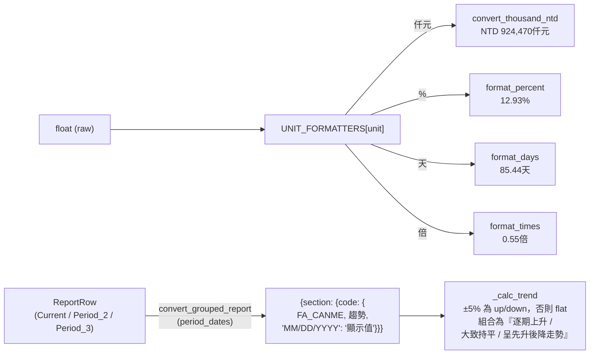

# 06 Data Flow

資料在管線中歷經數次型別轉換，每一步都對應 [`types.py`](../src/risk_engine/types.py) 中的一個 TypedDict。

## 1 整體型別轉換鏈

```mermaid
flowchart TD
    A["原始檔<br/>CSV / JSON / HTML / xlsx"] -->|loader.load_report<br/>or html_to_json| B["Report<br/>{code: ReportRow}"]
    B -->|Pipeline.filter_and_group<br/>(narrative_filter)| C["GroupedReport<br/>{section: {code: ReportRow}}"]
    C -->|combine_prompt.render_narrative_prompt<br/>json.dumps → 替換 {{JSON_DATA}}| D[narrative_prompt: str]
    B -->|report.generate_report| E[逐指標求值]
    E --> E1["formula.evaluate_formula<br/>current/prev: float|None"]
    E --> E2["formula.extract_operands<br/>Operand list"]
    E --> E3["formula.classify_formula<br/>value_kind, value_label"]
    E1 --> F[checker.check_rule]
    F -->|absolute / period_change_*| G[直接以 current/prev 比對]
    F -->|compound| H["evaluate_node 遞迴<br/>→ ConditionDetail list"]
    G --> I["TagResult<br/>{tag_id, status, threshold,<br/>description, condition_details?}"]
    H --> I
    I -->|_enrich_condition_details<br/>補 subject + display| J["IndicatorEntry"]
    J --> K["FullReport<br/>customer_id, report_date,<br/>industry, summary, sections"]
    K -->|post_rules.apply_post_rules<br/>pass-through，預留 meta-rule| K
    K -->|to_prompt_view| L2[剝除代碼/原始數值的視圖]
    L2 --> M[combine_prompt.render_prompt]
    M -->|json.dumps| M1["{{risk_results_1..5}}"]
    K -->|assemble_exe_output| N["ExeOutput<br/>schema_version=1.0 + metadata"]
```

## 2 各層型別速查

| 階段 | 型別 | 來源 |
|------|------|------|
| 載入後的單一財報科目 | `ReportRow`（FA_CANME / 單位 / Current / Period_2 / Period_3） | [`types.ReportRow`](../src/risk_engine/types.py) |
| 載入後的全部財報 | `Report = dict[str, ReportRow]` | [`types.Report`](../src/risk_engine/types.py) |
| 過濾分群後 | `GroupedReport = dict[str, dict[str, ReportRow]]` | [`types.GroupedReport`](../src/risk_engine/types.py) |
| 條件樹節點 | `ConditionLeaf` / `LogicNode` / `ConditionNode` | [`types.ConditionNode`](../src/risk_engine/types.py) |
| 單條規則 | `Rule`（含 condition_tree 給 compound 用） | [`types.Rule`](../src/risk_engine/types.py) |
| 單條規則的判定 | `TagResult` | [`types.TagResult`](../src/risk_engine/types.py) |
| 公式運算元 | `Operand`（含 period_label / display） | [`types.Operand`](../src/risk_engine/types.py) |
| 單一指標完整結果 | `IndicatorEntry`（含 operands + taggings） | [`types.IndicatorEntry`](../src/risk_engine/types.py) |
| 完整風險報告 | `FullReport` | [`types.FullReport`](../src/risk_engine/types.py) |
| Pipeline 最終結果 | `PipelineResult` | [`types.PipelineResult`](../src/risk_engine/types.py) |
| EXE 對外結果 | `ExeOutput` | [`types.ExeOutput`](../src/risk_engine/types.py) |

---

## 3 三值缺值傳播：實例 walk-through

假設規則：

```
section: 經營效能
indicator_name: 多重風險警示
threshold: "TIBB011 > 100 AND TIBB012 < 50 OR TIBB013 > 200"
```

由 [`threshold._build_tree`](../src/risk_engine/threshold.py) 解析（OR 優先）：

```
or
├── and
│   ├── leaf(TIBB011 > 100)
│   └── leaf(TIBB012 < 50)
└── leaf(TIBB013 > 200)
```

財報資料：

| 代碼 | Current | 解析結果 |
|------|---------|---------|
| TIBB011 | 120 | 120 > 100 → **true** |
| TIBB012 | （缺資料） | 缺值 → **None** |
| TIBB013 | 150 | 150 > 200 → **false** |

[`checker.evaluate_node`](../src/risk_engine/checker.py) 遞迴求值：

1. `leaf(TIBB011 > 100)` → true
2. `leaf(TIBB012 < 50)` → None（缺值傳播）
3. `and(true, None)` → None（AND 沒有 false，無法短路）
4. `leaf(TIBB013 > 200)` → false
5. `or(None, false)` → None（OR 沒有 true，無法短路）

最終 `status == "missing"`。

**關鍵點**：

- AND 短路規則：任一葉 `false` → 整體 `not_triggered`（不會 missing）。
- OR 短路規則：任一葉 `true` → 整體 `triggered`（不會 missing）。
- 沒有短路時，`None` 會傳播。

把上面例子改成 `TIBB011 = 80`（< 100 → false）：

1. `leaf(TIBB011 > 100)` → false
2. `and(false, ?)` → false（短路，不必算第二葉）
3. `or(false, false)` → false → `not_triggered`

這就是「false 比 missing 強」的設計。撰寫規則時可以利用這點：把最容易確定的條件放在 AND 樹的前面，可以避免不必要的 missing。

---

## 4 Prompt 視圖剝離（風險分支）

走完 [`generate_report`](../src/risk_engine/report.py) 拿到 `FullReport` 後，`render_risk_prompt` 會呼叫 [`to_prompt_view`](../src/risk_engine/report.py) 投影一次。

**為什麼要投影？** 同 [03_architecture.md#為什麼風險分支要有-to_prompt_view-投影層](03_architecture.md#為什麼風險分支要有-to_prompt_view-投影層)。

**對照**：以「固定長期適合率」單一條目為例

```json
// 原始 risk_sample.json
{
  "indicator_name": "固定長期適合率",
  "indicator_code": "(TIBA009-TIBA014)/(TIBA040+TIBA026)",
  "current_value": 0.55,
  "current_display": "0.55倍",
  "value_kind": "current",
  "value_label": "當期值",
  "operands": [
    { "code": "TIBA009", "name": "非流動資產",
      "period": "Current", "period_label": "當期",
      "value": 924470.0, "unit": "仟元",
      "display": "NTD 924,470仟元" }
  ],
  "taggings": [
    { "tag_id": "STRUCT_TAG1", "status": "not_triggered",
      "threshold": ">1.0", "description": "不滿足條件" }
  ]
}

// 經 to_prompt_view 投影（risk_prompt_input_sample.json）
{
  "indicator_name": "固定長期適合率",
  "value_kind": "current",
  "value_label": "當期值",
  "current_display": "0.55倍",
  "operands": [
    { "period": "當期", "name": "非流動資產",
      "display": "NTD 924,470仟元" }
  ],
  "taggings": [
    { "status": "not_triggered" }
  ]
}
```

**投影規則**（見 [`report._prompt_indicator`](../src/risk_engine/report.py)、[`_prompt_tag`](../src/risk_engine/report.py)、[`_prompt_condition_detail`](../src/risk_engine/report.py)）：

| 層級 | 規則 |
|------|------|
| IndicatorEntry | 移除 `indicator_code`、`current_value`、`previous_value`、`previous_display`。 |
| Operand | 移除 `code` / `value` / `period(原本=Current/Period_2/...)` / `unit`；保留 `name` / `display`；`period_label` 改名為 `period`。 |
| Tag (not_triggered/missing) | 只留 `{"status": "not_triggered"}`，其他欄位全部移除。 |
| Tag (triggered, 一般規則) | 留 `status` + `description` + `threshold`。 |
| Tag (triggered, compound) | 留 `status` + `description` + `condition_details`（含 `subject` / `kind_label` / `display` / `operator` / `threshold` / `result`），**不留 top-level threshold**（含原始代碼）。 |

完整對照表見專案根 [README.md#prompt-精簡視圖to_prompt_view](../README.md#prompt-精簡視圖to_prompt_view)。

---

## 5 單位推斷（`report._infer_unit`）

[`report._infer_unit`](../src/risk_engine/report.py) 在 `current_display` 階段決定要用什麼單位顯示。

| 公式形式 | 推斷單位 | 說明 |
|---------|---------|------|
| `result_unit` 在 config 有指定 | 直接採用 | 最高優先 |
| 公式所有代碼單位一致 + 不含除法 | 採用該單位 | 例：`A+B-C`，全為「仟元」→ 仟元 |
| 公式有除法但分子分母同單位（無外層 `*<常數>`） | 視為無量綱 | 例：`A/B` 全為「仟元」→ 空 |
| 公式末端含外層 `*<常數>` | 沿用 operand 單位 | 例：`(A/B)*100`，全為「仟元」→ 仟元（解讀為「百分點」） |
| 其他情況 | 空字串 | safe fallback |

撰寫陷阱：`(銀行借款+短期票券+公司債)/權益總額)*權益總額` 結果其實是「仟元」（不是 %），因為末端 `*權益總額` 把比率放大成原單位。這時可以在 xlsx「敘事指標」sheet 用 `替換單位` 直接覆寫顯示單位。詳見 [08_config_authoring.md](08_config_authoring.md)。

---

## 6 格式化輔助（`utils/simple_convert.py`）



對應檔案：[src/utils/simple_convert.py](../src/utils/simple_convert.py)。`convert_grouped_report` 把 `Period_2` / `Period_3` 等抽象期別 key 換成實際 `MM/DD/YYYY` 字串，是 narrative 分支送 LLM 前的最後一道整形。

---

## 7 資料流關鍵不變式

| 不變式 | 影響 |
|--------|------|
| `None` 即缺資料 | 不要在核心模組裡用預設值替代 `None` |
| 不可變代碼集 | `extract_codes` 永遠去重 + 保留出現順序 + 已剝除 `_PRV` / `_PRV2` |
| OR 優先解析 | `_build_tree` 與 `_parse_compound` 皆先 OR 後 AND |
| Prompt 視圖剝離 | `to_prompt_view` 只保留 `display` |

完整列表見 [04_spec.md#5-不變式必讀](04_spec.md#5-不變式必讀)。

---

## 下一步

- 在某個模組找特定函式 → [07_module_reference.md](07_module_reference.md)
- 撰寫新規則 → [08_config_authoring.md](08_config_authoring.md)
