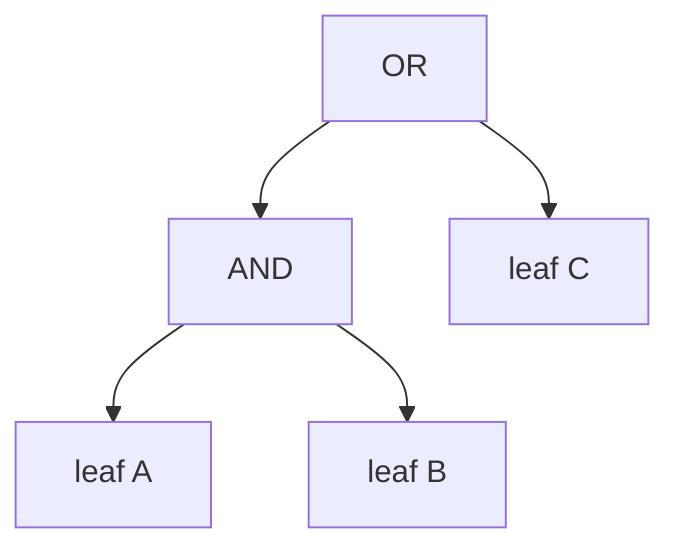

# 08 撰寫設定（指標 xlsx）

新人最常做的事：**新增 / 修改規則**。整個系統在 EXE 流程中以 xlsx 為唯一指標來源；改規則 = 改 xlsx + 重跑 = 不必重編譯 EXE。本檔涵蓋日常撰寫；正式語法定義見 [04_spec.md](04_spec.md) 與專案根 [README.md](../README.md) 的「資料格式」章節。

## 1 xlsx 結構總覽

xlsx 必含兩個 sheet（找不到時 fallback 為 `Sheet1` / `Sheet2`，亦可用 `--indicator-sheet` / `--filter-sheet` 指定）：

| Sheet | 用途 |
|-------|------|
| `指標` | 風險判定規則（rules，餵給 `indicators_config.json`） |
| `敘事指標` | 敘事過濾（narrative_filter，餵給 `narrative_filter.json`） |

實際解析在 [`utils/xlsx_to_indicators.py`](../src/utils/xlsx_to_indicators.py)。

---

## 2 「指標」sheet 欄位

對應 [`Rule`](../src/risk_engine/types.py) 與 [`utils.xlsx_to_indicators.parse_indicator_sheet`](../src/utils/xlsx_to_indicators.py)。

| 欄位 | 必填 | 說明 |
|------|------|------|
| 產業別 | ✓ | 例：`7大指標`。對應 `--industry` 旗標。 |
| 財務分析指標 | ✓ | 屬於哪一個段落（`財務結構` / `償債能力` / `經營效能` / `獲利能力` / `現金流量`）。**只能五擇一**。 |
| 指標名稱 | ✓ | LLM 看得到的中文名稱。 |
| 指標對應財報欄位 | ✓ | 公式（見 §3）。 |
| 指標編號 | ✓ | `tag_id`，內部識別用。建議格式 `<段落代碼>_TAG<n>`（如 `STRUCT_TAG1`）。 |
| 指標判斷門檻值 | ✓ | 中文門檻字串（見 §4）。 |
| 風險情境 | ✓ | 觸發時要送進 LLM 的 `description`。 |
| 結果單位 | – | 強制覆寫 `current_display` 的單位。空白則由 [`_infer_unit`](../src/risk_engine/report.py) 自動推斷。 |

### 2.1 單位推斷陷阱

如果你的公式末端有 `*<常數>`（例如 `(A/B)*100`），運算結果會把比率放大成原 operand 的單位（如「仟元」），而不是 `%`。如果這時想顯示為 `%`，請在「結果單位」欄填 `%`。

詳見 [06_data_flow.md#5-單位推斷report_infer_unit](06_data_flow.md#5-單位推斷report_infer_unit)。

---

## 3 公式語法

| 形式 | 範例 | 解析後 |
|------|------|-------|
| 單一代碼 | `TIBB002` | 取 `TIBB002.Current` |
| 四則運算 | `TIBB013+TIBB011-TIBB012` | 三項相加減 |
| 含括號 | `(TIBA049+TIBA047+TIBC003)/TIBA047` | 分子分母 |
| 含前期 | `TIBB011-TIBB011_PRV` | `Current - Period_2` |
| 含前前期 | `TIBB011-TIBB011_PRV2` | `Current - Period_3` |

代碼後綴：

| 後綴 | 對應期別 |
|------|---------|
| 無 | `Current`（當期） |
| `_PRV` | `Period_2`（前期） |
| `_PRV2` | `Period_3`（前前期） |

公式安全限制（見 [`formula._safe_eval`](../src/risk_engine/formula.py)）：

- 僅允許 `+ - * /` 與括號。
- 任何其他符號（`%` / `^` / 函式呼叫）會被拒絕，公式回傳 `None` → 規則 `missing`。
- 除以零回 `None`。
- 任一代碼缺失（不在 report 或對應期別為 None）回 `None`。

---

## 4 中文門檻語法

由 [`threshold.parse_threshold`](../src/risk_engine/threshold.py) 解析。**全形 `＞ ＜ ＝` 自動轉半形**，不需自行預處理。

### 4.1 absolute（絕對門檻）

| 範例 | 結果 |
|------|------|
| `>150%` | `compare_type=absolute, operator=>, threshold=150.0` |
| `<100%` | `<` 100.0 |
| `<0` | `<` 0.0 |
| `>=30` | `>=` 30.0 |
| `<=180天` | `<=` 180.0 |
| `<-5` | `<` -5.0（負值門檻支援） |

末尾的 `%` / `天` 只是註記，**不影響數值**。

### 4.2 period_change_pct（前期比率變動）

| 範例 | 結果 |
|------|------|
| `較前期比率增加20%` | `period_change_pct, direction=increase, threshold=20.0` |
| `較前期比率減少10%` | `direction=decrease, threshold=10.0` |

判定邏輯：先檢查方向（`(current - prev) / abs(prev)` 的正負），再比絕對變動率。前期為 0 時回 `missing`。

### 4.3 period_change_abs（前期絕對變動）

| 範例 | 結果 |
|------|------|
| `較前期增加60天` | `period_change_abs, direction=increase, threshold=60.0` |
| `較前期減少30` | `direction=decrease, threshold=30.0` |

### 4.4 compound（複合條件）

含 `AND` / `OR` 即視為 compound。

```
TIBB011 > 100 AND TIBB012 < 50
TIBB011 > 100 OR TIBB011 < 0
(TIBA040 > 0 AND TIBB002 > 150) OR TIBB013 > 200
```

#### OR 優先解析陷阱

[`threshold._build_tree`](../src/risk_engine/threshold.py) 先依 `\s+OR\s+` 分割，再依 `\s+AND\s+`。所以：

```
A AND B OR C   →   or(and(A, B), C)
```

這與 SQL / Python 的「AND 優先於 OR」**反向**。

**強烈建議：撰寫時一律用括號明確化**，不要依賴隱式優先順序。



### 4.5 unknown（無法解析）

無法 match 任何 pattern → `compare_type=unknown`，規則一律回 `missing`。請檢查語法。

---

## 5 「敘事指標」sheet 欄位

對應 narrative_filter，由 [`utils.xlsx_to_indicators.parse_filter_sheet`](../src/utils/xlsx_to_indicators.py) 解析。

| 欄位 | 必填 | 說明 |
|------|------|------|
| 產業別 | ✓ | 同「指標」sheet。 |
| 段落 | ✓ | 五個段落之一。 |
| 會計科目 | ✓ | 顯示名稱（給 LLM 看的中文名）。 |
| 會計科目代碼 | ✓ | `TIBA040` 之類的代碼，或公式（見下）。 |
| 計算公式 / 公式 | – | 若提供，會作為主要計算式（敘事指標也可以是計算結果而非單一代碼）。 |
| 顯示名稱 | – | 覆寫「會計科目」欄。 |
| 單位 | – | 對該項顯示用的單位。 |
| 替換單位 | – | **優先於「單位」**。當公式末端 `*<operand>` 改變了量綱時，用這欄手動覆寫。例：`((銀行借款+短期票券+公司債)/權益總額)*權益總額` 結果為「仟元」而非「%」，可在這欄填「仟元」。 |

### 5.1 為什麼敘事與規則分兩個 sheet？

**敘事**：給 LLM 看的「原始科目值」清單，依段落分群。LLM 不會看到規則欄位（threshold、operator 等）。

**規則**：給 checker 用的判定邏輯。LLM 只會看到判定後的結果（觸發 / 未觸發）+ 當期值的 display。

兩者**邏輯獨立**，避免互相污染。詳見 [03_architecture.md#為什麼要分兩條分支](03_architecture.md#為什麼要分兩條分支)。

---

## 6 修改後驗證

```bash
# 1. 用 CLI 把 xlsx 轉出來看結構
python -m utils.xlsx_to_indicators 指標.xlsx \
    --config-out /tmp/indicator.json \
    --filter-out /tmp/narrative_filter.json

# 2. 查看落地 JSON 是否符合預期
cat /tmp/indicator.json | python -m json.tool | head -50

# 3. 跑 legacy CLI 用既有 JSON 財報驗證
python scripts/risk_checker.py \
    --report inputs/json_sample/sample_report.json \
    --config /tmp/indicator.json \
    --industry 7大指標 \
    -o /tmp/result.json --debug

# 4. 跑 EXE 流程做完整驗證
python scripts/main.py f1.html f2.html f3.html f4.html \
    --industry 7大指標 \
    --xlsx 指標.xlsx \
    -o /tmp/exe.json
```

如果新增的規則用 `compound` 條件，**請特別測試 OR 優先解析**：在 `inputs/json_sample/risk_sample.json` 上寫個 mini test 看 condition_tree 是不是符合預期。

---

## 7 常見錯誤

| 症狀 | 可能原因 |
|------|---------|
| 規則 `status=missing`，但代碼明明在財報裡 | 公式裡含非法字元（`%` 不能當運算子）；或代碼後綴錯（`_PRE` 而非 `_PRV`）。 |
| `ConfigError: 產業 'xxx' 不存在` | xlsx「產業別」欄與 `--industry` 旗標不符。 |
| 觸發了卻沒看到 `description` 在 prompt 裡 | 觸發的是 compound，看 `condition_details` 而不是 top-level threshold。 |
| `current_display` 顯示為「2.55」而非「2.55%」 | 公式末端有 `*100`，自動推斷的單位是 operand 的（如「仟元」）。請在「結果單位」欄填 `%`。 |
| AND/OR 解析跟想像不同 | OR 優先解析。請用括號明確化。 |

---

## 下一步

- 想擴充比較類型 / 門檻語法 / 段落 → [09_extending.md](09_extending.md)
- 想 debug → [10_testing_and_debugging.md](10_testing_and_debugging.md)
